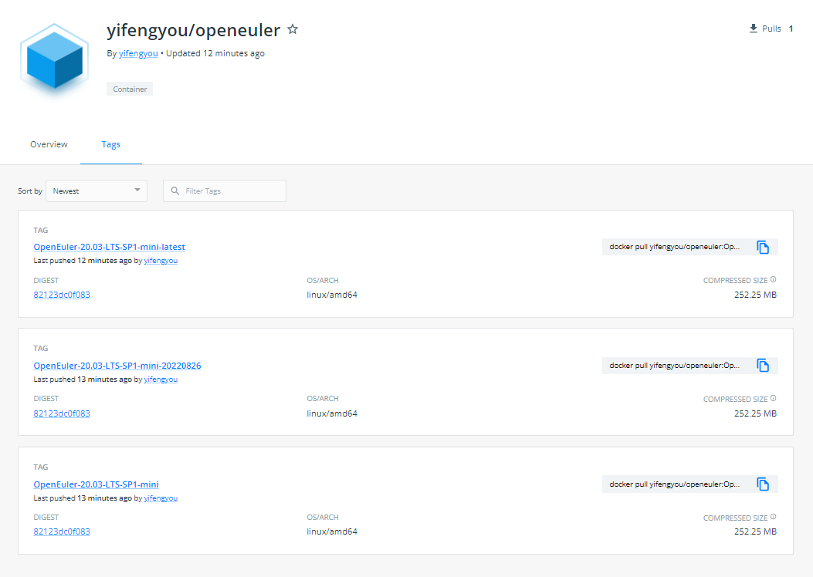

<!-- MDTOC maxdepth:6 firsth1:1 numbering:0 flatten:0 bullets:1 updateOnSave:1 -->

- [OpenEuler-22.03-LTS-mini-x86_64](#openeuler-2003-lts-sp1-mini-x86_64)   
   - [mock配置](#mock配置)   
   - [使用mock制作rootfs](#使用mock制作rootfs)   
   - [制作docker镜像](#制作docker镜像)   
   - [推送dockerhub](#推送dockerhub)   
   - [其他设置](#其他设置)   

<!-- /MDTOC -->
# OpenEuler-22.03-LTS-mini-x86_64


## mock配置

**/etc/mock/OpenEuler-22.03-LTS-mini-x86_64.cfg**

```
config_opts['root'] = 'openEuler-22.03-LTS-mini'
config_opts['target_arch'] = 'x86_64'
config_opts['legal_host_arches'] = ('x86_64',)
config_opts['useradd'] = '/usr/sbin/useradd -m -u {{chrootuid}} -g {{chrootgid}} -d {{chroothome}} {{chrootuser}}'

config_opts['chroot_setup_cmd'] = 'install openEuler-rpm-config openEuler-release systemd yum vim'
config_opts['dist'] = 'oe1'  # only useful for --resultdir variable subst
config_opts['releasever'] = '8'
config_opts['package_manager'] = 'dnf'
config_opts['extra_chroot_dirs'] = [ '/run/lock', ]
config_opts['description'] = 'openEuler-22.03-LTS'
config_opts['macros']['%dist']=".oe1"

config_opts['dnf.conf'] = """
[main]
keepcache=1
debuglevel=2
reposdir=/dev/null
logfile=/var/log/yum.log
retries=20
obsoletes=1
gpgcheck=0
assumeyes=1
syslog_ident=mock
syslog_device=
metadata_expire=0
mdpolicy=group:primary
best=0
install_weak_deps=0
protected_packages=

[OS]
name=OS
baseurl=http://repo.openeuler.org/openEuler-22.03-LTS/OS/$basearch/
enabled=1
gpgcheck=1
gpgkey=http://repo.openeuler.org/openEuler-22.03-LTS/OS/$basearch/RPM-GPG-KEY-openEuler

[everything]
name=everything
baseurl=http://repo.openeuler.org/openEuler-22.03-LTS/everything/$basearch/
enabled=1
gpgcheck=1
gpgkey=http://repo.openeuler.org/openEuler-22.03-LTS/everything/$basearch/RPM-GPG-KEY-openEuler

[EPOL-main]
name=EPOL
baseurl=http://repo.openeuler.org/openEuler-22.03-LTS/EPOL/main/$basearch/
enabled=1
gpgcheck=1
gpgkey=http://repo.openeuler.org/openEuler-22.03-LTS/OS/$basearch/RPM-GPG-KEY-openEuler

#[EPOL-multi_version]
#name=EPOL
#baseurl=http://repo.openeuler.org/openEuler-22.03-LTS/EPOL/multi_version/$basearch/
#enabled=1
#gpgcheck=1
#gpgkey=http://repo.openeuler.org/openEuler-22.03-LTS/OS/$basearch/RPM-GPG-KEY-openEuler


#[EPOL-update-multi_version]
#name=EPOL
#baseurl=http://repo.openeuler.org/openEuler-22.03-LTS/EPOL/update/multi_version/$basearch/
#enabled=1
#gpgcheck=1
#gpgkey=http://repo.openeuler.org/openEuler-22.03-LTS/OS/$basearch/RPM-GPG-KEY-openEuler

[EPOL-update-main]
name=EPOL
baseurl=http://repo.openeuler.org/openEuler-22.03-LTS/EPOL/update/main/$basearch/
enabled=1
gpgcheck=1
gpgkey=http://repo.openeuler.org/openEuler-22.03-LTS/OS/$basearch/RPM-GPG-KEY-openEuler

[debuginfo]
name=debuginfo
baseurl=http://repo.openeuler.org/openEuler-22.03-LTS/debuginfo/$basearch/
enabled=1
gpgcheck=1
gpgkey=http://repo.openeuler.org/openEuler-22.03-LTS/debuginfo/$basearch/RPM-GPG-KEY-openEuler

[source]
name=source
baseurl=http://repo.openeuler.org/openEuler-22.03-LTS/source/
enabled=1
gpgcheck=1
gpgkey=http://repo.openeuler.org/openEuler-22.03-LTS/source/RPM-GPG-KEY-openEuler

[update]
name=update
baseurl=http://repo.openeuler.org/openEuler-22.03-LTS/update/$basearch/
enabled=1
gpgcheck=1
gpgkey=http://repo.openeuler.org/openEuler-22.03-LTS/OS/$basearch/RPM-GPG-KEY-openEuler
"""

```

## 使用mock制作rootfs

```
su - mockbuild -c "mock -r OpenEuler-22.03-LTS-mini-x86_64 init"

```

mock构建的rootfs在```/var/lib/mock/OpenEuler-22.03-LTS-mini-x86_64/root```路径下


## 制作docker镜像

可以用systemd-nspawn启动进去变更rootfs，当然也可以不，纯净版


```
cd /var/lib/mock/OpenEuler-22.03-LTS-mini-x86_64/root
tar -c . | docker import - yifengyou/openeuler:OpenEuler-22.03-LTS-mini
```

```
docker tag yifengyou/openeuler:OpenEuler-22.03-LTS-mini yifengyou/openeuler:OpenEuler-22.03-LTS-mini-latest
docker tag yifengyou/openeuler:OpenEuler-22.03-LTS-mini yifengyou/openeuler:OpenEuler-22.03-LTS-mini-20220826

```


## 推送dockerhub

```

docker push yifengyou/openeuler:OpenEuler-22.03-LTS-mini
docker push yifengyou/openeuler:OpenEuler-22.03-LTS-mini-latest
docker push yifengyou/openeuler:OpenEuler-22.03-LTS-mini-20220826


```

* <https://hub.docker.com/r/yifengyou/openeuler>



## 其他设置


```
export PS1='\[\e[32;1m\][\[\e[31;1m\]\u\[\e[33;1m\]@\[\e[35;1m\]\h\[\e[36;1m\] \w\[\e[32;1m\]]\[\e[37;1m\]\$\[\e[0m\] '
```


---
